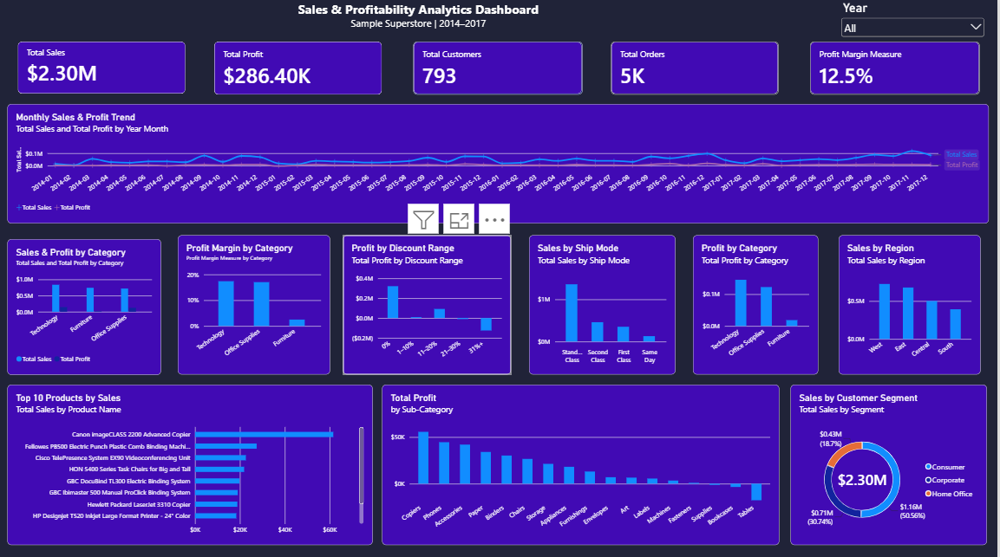

# Sales & Profitability Analytics Dashboard

An end-to-end retail sales and profitability analysis project using the Sample Superstore dataset. The project combines Excel, Power Query, Power BI, DAX, and SQL-oriented analysis to identify sales trends, profitability patterns, and business performance insights.

## Dashboard Preview



## Project Overview

This project analyzes retail sales data from 2014–2017 to understand:

- Overall sales and profit performance
- Sales and profit trends over time
- Category and sub-category profitability
- Regional performance
- Customer segment performance
- Impact of discount levels on profitability
- Top-performing products
- Shipping mode performance

## Key Performance Indicators

| KPI | Result |
|---|---:|
| Total Sales | $2.30M |
| Total Profit | $286.40K |
| Total Orders | 5,009 |
| Total Customers | 793 |
| Profit Margin | 12.5% |

## Key Insights

- Technology generated the highest profit among the three product categories.
- Furniture generated substantial sales but had a relatively low profit margin.
- The West region generated the highest sales and profit.
- Higher discount ranges were associated with lower profitability.
- Tables, Bookcases, and Supplies recorded negative total profit.
- November 2017 recorded the highest monthly sales.
- December 2016 recorded the highest monthly profit.

## Tools & Technologies

- **Microsoft Excel** – data validation, calculations, and exploratory analysis
- **Power Query** – data cleaning and transformation
- **Power BI** – interactive dashboard and data visualization
- **DAX** – calculated measures and time-based analysis
- **MySQL / SQL** – planned database-based analysis

## Data Preparation

The dataset was cleaned and prepared using Power Query.

Data preparation included:

- Correcting data types
- Checking for errors and missing values
- Creating a Profit Margin column
- Validating sales, quantity, discount, and profit values
- Preparing the dataset for Power BI analysis

## Power BI Dashboard

The dashboard includes:

- KPI cards
- Monthly Sales & Profit Trend
- Sales & Profit by Category
- Profit by Sub-Category
- Sales by Region
- Top 10 Products by Sales
- Profit Margin by Category
- Profit by Discount Range
- Sales by Customer Segment
- Sales by Ship Mode
- Year filter/slicer

## Project Structure

```text
sales-profitability-analytics/
├── data/
│   ├── README.md
│   └── Sample - Superstore.csv
├── powerbi/
│   └── Sales & Profitability Analytics Dashboard.pbix
├── dashboard-preview.png
└── README.md
```

## Author

**Al-Sani M. Minalang**

BS Information Systems  
Mindanao State University
